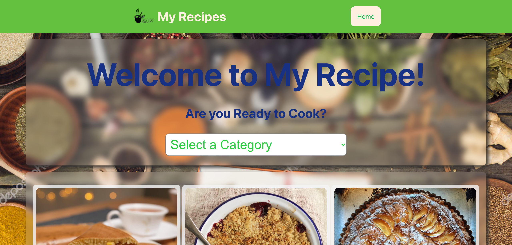

<h3 align="center">Catalogue of Recipes</h3>

Catalogue of Recipes  app in React is a practice project, which includes manipulating dynamically the Virtual DOM and, use States and Props (useState Hook) and useEffect Hook to change the information accordingly with the user interactions. All photos are retrieved from Unsplash API and the information kept on a Redux store available on all application components. In order to test the React Components, I use React Testing Library. Built with React, JavaScript, HTML5, CSS3, Bootstrap, Redux and Prop-types.

## App Screenshot

## Live Link Demo

[Catalogue of Recipes](https://rawshan-recipes.herokuapp.com/)

## Project videos
https://www.loom.com/share/6d402a6d02ad4e3a86f82d4ac148b458

## Built With

- React
- HTML5
- CSS3
- Bootstrap
- JavaScript
- React Testing Library
- Redux
- Redux thunk

## Getting Started

To get a local copy up and running follow these simple example steps.

### Prerequisites

- Text Editor (VSCode is suggested.)

### Setup

- Install [git](https://git-scm.com/downloads)
- Open Terminal
- Change directory to folder to download repository
- Use `cd <file-path>`
- Run `git clone https://github.com/sumon0002001/catalogue-recipe/`
- Enter the project's folder `cd catalogue-recipe`
- This projects uses the https://www.themealdb.com/ API to get photos. 
  

To make any change,

- Open related file by using text editor.

## Usage
- Run `npm install` on your terminal to install npm
  - Run `npm start` on your terminal to open the server automatically on your browser
  - If it doesn't open automatically go to your browser and type the url `http://localhost:3000`
  - If you prefer to use the production minified JavaScript file run `npm run build` to create the build folder with the distribution files that can be served on your server.

## Test
  - Run `npm run test` to perform unit tests, also tests if React components are being correctly rendered;
   
## Author

👤  **Mir Rawshan Ali**

- GitHub: [@sumon0002009](https://github.com/sumon0002001)
- Twitter: [@sumon0002009](https://twitter.com/Sumon0002009)
- LinkedIn: [Mir Rawshan Ali](https://www.linkedin.com/in/mir-rawshan-ali/)

## 🤝 Contributing

Contributions, issues and feature requests are welcome! Start by:

- Forking the project
- Cloning the project to your local machine
- `cd` into the project directory
- Run `git checkout -b your-branch-name`
- Make your contributions
- Push your branch up to your forked repository
- Open a Pull Request with a detailed description to the development branch of the original project for a review

## Show your support

Give a ⭐️ if you like this project!

## Acknowledgments

- React
- Bootstrap
- W3Schools
- Font Awesome
- Javascript
- React Testing Library
- Redux
- Redux-thunk
- Unsplash

